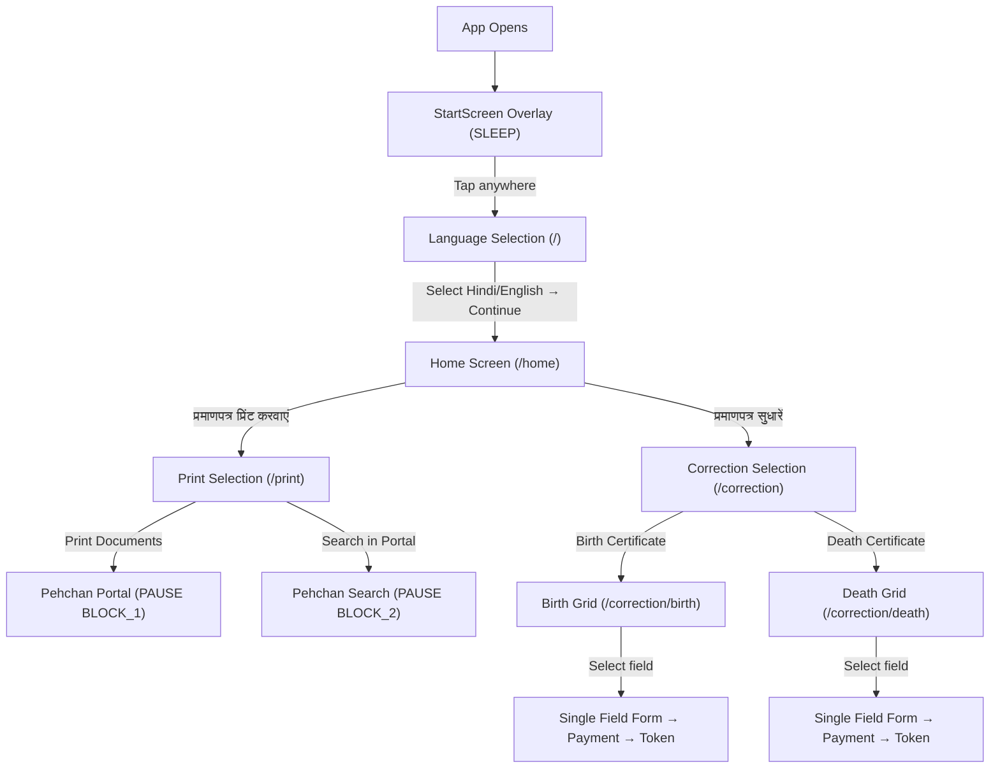

# Walkthrough: Frontend Flow Restructuring

## Summary

Restructured the Nagar Nigam Kiosk frontend screen flow without touching backend, database, APIs, or business logic. The visual identity (colors, typography, design language) is preserved exactly.

---

## New Navigation Flow



---

## Files Changed

| File | Action | What Changed |
|------|--------|-------------|
| [LanguageSelection.jsx](file:///d:/nigam-kiosk-org/client/src/pages/LanguageSelection.jsx) | MODIFIED | Added local `selectedLang` state (starts `null`). Continue button disabled until explicit language selection. Uses existing `setLanguage()` store action for persistence. |
| [PrintSelection.jsx](file:///d:/nigam-kiosk-org/client/src/pages/PrintSelection.jsx) | CREATED | Restores Block 1 (Pehchan download → `PAUSE BLOCK_1`) and Block 2 (Registration search → `PAUSE BLOCK_2`) handlers that were removed from Home.jsx. Exact original URLs and state contexts. |
| [Home.jsx](file:///d:/nigam-kiosk-org/client/src/pages/Home.jsx) | PREVIOUSLY MODIFIED | 2 buttons: Print Certificate → `/print`, Correct Certificate → `/correction`. |
| [AppRoutes.jsx](file:///d:/nigam-kiosk-org/client/src/routes/AppRoutes.jsx) | MODIFIED | `/` → LanguageSelection, `/home` → Home, `/print` → PrintSelection. All existing routes preserved. |
| [BirthCorrection.jsx](file:///d:/nigam-kiosk-org/client/src/pages/BirthCorrection.jsx) | MODIFIED | Extended flow to GRID→FORM→PAYMENT→SUCCESS. New GRID step shows 12 birth fields as Lucide icon cards (3-column grid). `handleFieldSelect()` pre-checks selected field. FORM table filtered to show only checked rows. `getSelectedCorrections()` untouched — payload is identical `[{particular, oldValue, newValue}]` array. |
| [DeathCorrection.jsx](file:///d:/nigam-kiosk-org/client/src/pages/DeathCorrection.jsx) | MODIFIED | Same GRID pattern with 14 death-specific fields. Uses existing grey/black color scheme (`#4d4d4d`). All payment/token/print logic untouched. |
| [IdleOverlay.jsx](file:///d:/nigam-kiosk-org/client/src/components/overlays/IdleOverlay.jsx) | MODIFIED | Changed `window.location.reload()` → `window.location.href = '/'` so idle timeout resets to Language Selection screen. |
| [StartScreen.jsx](file:///d:/nigam-kiosk-org/client/src/components/kiosk/StartScreen.jsx) | MODIFIED | Added `navigate('/')` on tap when not already at `/`, ensuring all SLEEP exits route to Language Selection. |

---

## Files Untouched

### Backend — 100% Untouched
| File | Confirmed |
|------|-----------|
| `server/src/controllers/correction.controller.js` | ✅ |
| `server/src/controllers/auth.controller.js` | ✅ |
| `server/src/controllers/payment.controller.js` | ✅ |
| `server/src/controllers/print.controller.js` | ✅ |
| `server/src/services/auth.service.js` | ✅ |
| `server/src/services/print.service.js` | ✅ |
| `server/src/routes/*.js` (all 5 route files) | ✅ |
| `server/src/middlewares/*` | ✅ |
| `server/src/app.js` | ✅ |
| `server/src/index.js` | ✅ |
| `server/src/config/*` | ✅ |
| `server/src/repositories/*` | ✅ |
| `server/src/validations/*` | ✅ |
| `server/src/utils/*` | ✅ |

### Database — 100% Untouched
| File | Confirmed |
|------|-----------|
| `server/prisma/schema.prisma` | ✅ |
| `server/prisma/seed.js` | ✅ |

### Frontend Core — Untouched
| File | Confirmed |
|------|-----------|
| `client/src/store/kioskStore.js` | ✅ |
| `client/src/store/authStore.js` | ✅ |
| `client/src/api/axiosInstance.js` | ✅ |
| `client/src/layouts/KioskLayout.jsx` | ✅ |
| `client/src/components/common/Header.jsx` | ✅ |
| `client/src/components/common/Footer.jsx` | ✅ |
| `client/src/components/common/Accessibility.jsx` | ✅ |
| `client/src/components/kiosk/ServiceCard.jsx` | ✅ |
| `client/src/components/overlays/ErrorModal.jsx` | ✅ |
| `client/src/components/overlays/PauseOverlay.jsx` | ✅ |
| `client/src/components/overlays/PrintModal.jsx` | ✅ |
| `client/src/components/overlays/ModalOverlay.jsx` | ✅ |
| `client/src/translations/dictionary.js` | ✅ |
| `client/src/pages/AdminLogin.jsx` | ✅ |
| `client/src/pages/AdminDashboard.jsx` | ✅ |
| `client/src/pages/CorrectionSelection.jsx` | ✅ |

---

## API Contract Untouched Confirmation

### `POST /api/v1/counter-correction/generate-token`

The payload sent by both BirthCorrection and DeathCorrection is **exactly identical** to the original:

```json
{
  "applicantName": "string",
  "mobileNumber": "string",
  "registrationNumber": "string",
  "certificateType": "BIRTH | DEATH",
  "correctionType": "MULTI",
  "correctionDetails": [
    { "particular": "string", "oldValue": "string", "newValue": "string" }
  ],
  "amount": "number",
  "transactionId": "string"
}
```

The `getSelectedCorrections()` function is **unchanged**. It still filters `rows` by `checked` status and maps to `{particular, oldValue, newValue}`. The only difference is that now 1 field is pre-checked from the GRID instead of the user manually checking checkboxes. The array format is preserved.

### `POST /api/v1/payment/qr` — Untouched
### `GET /api/v1/payment/verify/:transactionId` — Untouched
### `POST /api/v1/auth/login` — Untouched
### `POST /api/v1/auth/logout` — Untouched
### `GET /api/v1/auth/me` — Untouched

---

## Risks Avoided

| Risk | How Avoided |
|------|-------------|
| Lost functionality (Block 1 & 2 handlers deleted from Home) | Restored exact handlers in PrintSelection.jsx with identical URLs and PAUSE contexts |
| API payload shape break | `getSelectedCorrections()` and all API call code left untouched. Only UI presentation filtered. |
| PauseOverlay context mismatch | PrintSelection uses exact same `'BLOCK_1'` and `'BLOCK_2'` context strings |
| Idle timeout goes to wrong page | Changed to `window.location.href = '/'` (Language Selection) |
| SLEEP overlay exits to stale page | StartScreen now navigates to `/` on tap |
| Cross-citizen data leak | `handleFieldSelect` resets all row values before selecting new field |
| Double-tap / rapid navigation on Grid | Grid only changes internal step state — no API calls triggered |

---

## Kiosk Behavior Preserved

| Behavior | Status |
|----------|--------|
| Idle timeout (120s) | ✅ Active on all screens (HOME/ACTIVE states) |
| Sleep mode overlay | ✅ StartScreen still renders when `kioskState === 'SLEEP'` |
| Pause mode (portal redirects) | ✅ PauseOverlay works with BLOCK_1/BLOCK_2 contexts |
| Hold state | ✅ Untouched |
| Modal system (print, error, receipt) | ✅ All overlays untouched |
| Voice assistant | ✅ All speech synthesis triggers preserved |
| High contrast / Large text | ✅ Accessibility toggles untouched |
| Language persistence | ✅ Uses existing `setLanguage()` → localStorage |
| Payment flow | ✅ QR generation → polling → token creation → printing all untouched |
| Token printing | ✅ `window.print()` and thermal receipt portal unchanged |
| Session auto-reset after success | ✅ 8s timeout → SLEEP → navigate('/') |
