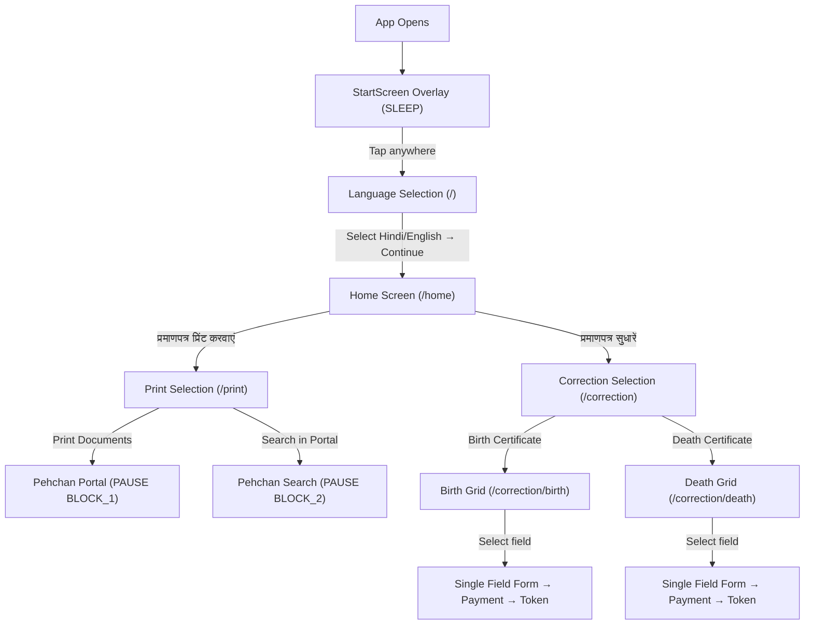

# Walkthrough: Frontend Flow Restructuring

## Summary

Restructured the Nagar Nigam Kiosk frontend screen flow without touching backend, database, APIs, or business logic. The visual identity (colors, typography, design language) is preserved exactly.

---

## New Navigation Flow



---

## Files Changed

| File | Action | What Changed |
|------|--------|-------------|
| [LanguageSelection.jsx](file:///d:/nigam-kiosk-org/client/src/pages/LanguageSelection.jsx) | MODIFIED | Added local `selectedLang` state (starts `null`). Continue button disabled until explicit language selection. Uses existing `setLanguage()` store action for persistence. |
| [PrintSelection.jsx](file:///d:/nigam-kiosk-org/client/src/pages/PrintSelection.jsx) | CREATED | Restores Block 1 (Pehchan download → `PAUSE BLOCK_1`) and Block 2 (Registration search → `PAUSE BLOCK_2`) handlers that were removed from Home.jsx. Exact original URLs and state contexts. |
| [Home.jsx](file:///d:/nigam-kiosk-org/client/src/pages/Home.jsx) | PREVIOUSLY MODIFIED | 2 buttons: Print Certificate → `/print`, Correct Certificate → `/correction`. |
| [AppRoutes.jsx](file:///d:/nigam-kiosk-org/client/src/routes/AppRoutes.jsx) | MODIFIED | `/` → LanguageSelection, `/home` → Home, `/print` → PrintSelection. All existing routes preserved. |
| [BirthCorrection.jsx](file:///d:/nigam-kiosk-org/client/src/pages/BirthCorrection.jsx) | MODIFIED | Extended flow to GRID→FORM→PAYMENT→SUCCESS. New GRID step shows 12 birth fields as Lucide icon cards (3-column grid). `handleFieldSelect()` pre-checks selected field. FORM table filtered to show only checked rows. `getSelectedCorrections()` untouched — payload is identical `[{particular, oldValue, newValue}]` array. |
| [DeathCorrection.jsx](file:///d:/nigam-kiosk-org/client/src/pages/DeathCorrection.jsx) | MODIFIED | Same GRID pattern with 14 death-specific fields. Uses existing grey/black color scheme (`#4d4d4d`). All payment/token/print logic untouched. |
| [IdleOverlay.jsx](file:///d:/nigam-kiosk-org/client/src/components/overlays/IdleOverlay.jsx) | MODIFIED | Changed `window.location.reload()` → `window.location.href = '/'` so idle timeout resets to Language Selection screen. |
| [StartScreen.jsx](file:///d:/nigam-kiosk-org/client/src/components/kiosk/StartScreen.jsx) | MODIFIED | Added `navigate('/')` on tap when not already at `/`, ensuring all SLEEP exits route to Language Selection. |

---

## Files Untouched

### Backend — 100% Untouched
| File | Confirmed |
|------|-----------|
| `server/src/controllers/correction.controller.js` | ✅ |
| `server/src/controllers/auth.controller.js` | ✅ |
| `server/src/controllers/payment.controller.js` | ✅ |
| `server/src/controllers/print.controller.js` | ✅ |
| `server/src/services/auth.service.js` | ✅ |
| `server/src/services/print.service.js` | ✅ |
| `server/src/routes/*.js` (all 5 route files) | ✅ |
| `server/src/middlewares/*` | ✅ |
| `server/src/app.js` | ✅ |
| `server/src/index.js` | ✅ |
| `server/src/config/*` | ✅ |
| `server/src/repositories/*` | ✅ |
| `server/src/validations/*` | ✅ |
| `server/src/utils/*` | ✅ |

### Database — 100% Untouched
| File | Confirmed |
|------|-----------|
| `server/prisma/schema.prisma` | ✅ |
| `server/prisma/seed.js` | ✅ |

### Frontend Core — Untouched
| File | Confirmed |
|------|-----------|
| `client/src/store/kioskStore.js` | ✅ |
| `client/src/store/authStore.js` | ✅ |
| `client/src/api/axiosInstance.js` | ✅ |
| `client/src/layouts/KioskLayout.jsx` | ✅ |
| `client/src/components/common/Header.jsx` | ✅ |
| `client/src/components/common/Footer.jsx` | ✅ |
| `client/src/components/common/Accessibility.jsx` | ✅ |
| `client/src/components/kiosk/ServiceCard.jsx` | ✅ |
| `client/src/components/overlays/ErrorModal.jsx` | ✅ |
| `client/src/components/overlays/PauseOverlay.jsx` | ✅ |
| `client/src/components/overlays/PrintModal.jsx` | ✅ |
| `client/src/components/overlays/ModalOverlay.jsx` | ✅ |
| `client/src/translations/dictionary.js` | ✅ |
| `client/src/pages/AdminLogin.jsx` | ✅ |
| `client/src/pages/AdminDashboard.jsx` | ✅ |
| `client/src/pages/CorrectionSelection.jsx` | ✅ |

---

## API Contract Untouched Confirmation

### `POST /api/v1/counter-correction/generate-token`

The payload sent by both BirthCorrection and DeathCorrection is **exactly identical** to the original:

```json
{
  "applicantName": "string",
  "mobileNumber": "string",
  "registrationNumber": "string",
  "certificateType": "BIRTH | DEATH",
  "correctionType": "MULTI",
  "correctionDetails": [
    { "particular": "string", "oldValue": "string", "newValue": "string" }
  ],
  "amount": "number",
  "transactionId": "string"
}
```

The `getSelectedCorrections()` function is **unchanged**. It still filters `rows` by `checked` status and maps to `{particular, oldValue, newValue}`. The only difference is that now 1 field is pre-checked from the GRID instead of the user manually checking checkboxes. The array format is preserved.

### `POST /api/v1/payment/qr` — Untouched
### `GET /api/v1/payment/verify/:transactionId` — Untouched
### `POST /api/v1/auth/login` — Untouched
### `POST /api/v1/auth/logout` — Untouched
### `GET /api/v1/auth/me` — Untouched

---

## Risks Avoided

| Risk | How Avoided |
|------|-------------|
| Lost functionality (Block 1 & 2 handlers deleted from Home) | Restored exact handlers in PrintSelection.jsx with identical URLs and PAUSE contexts |
| API payload shape break | `getSelectedCorrections()` and all API call code left untouched. Only UI presentation filtered. |
| PauseOverlay context mismatch | PrintSelection uses exact same `'BLOCK_1'` and `'BLOCK_2'` context strings |
| Idle timeout goes to wrong page | Changed to `window.location.href = '/'` (Language Selection) |
| SLEEP overlay exits to stale page | StartScreen now navigates to `/` on tap |
| Cross-citizen data leak | `handleFieldSelect` resets all row values before selecting new field |
| Double-tap / rapid navigation on Grid | Grid only changes internal step state — no API calls triggered |

---

## Kiosk Behavior Preserved

| Behavior | Status |
|----------|--------|
| Idle timeout (120s) | ✅ Active on all screens (HOME/ACTIVE states) |
| Sleep mode overlay | ✅ StartScreen still renders when `kioskState === 'SLEEP'` |
| Pause mode (portal redirects) | ✅ PauseOverlay works with BLOCK_1/BLOCK_2 contexts |
| Hold state | ✅ Untouched |
| Modal system (print, error, receipt) | ✅ All overlays untouched |
| Voice assistant | ✅ All speech synthesis triggers preserved |
| High contrast / Large text | ✅ Accessibility toggles untouched |
| Language persistence | ✅ Uses existing `setLanguage()` → localStorage |
| Payment flow | ✅ QR generation → polling → token creation → printing all untouched |
| Token printing | ✅ `window.print()` and thermal receipt portal unchanged |
| Session auto-reset after success | ✅ 8s timeout → SLEEP → navigate('/') |

---

## Cashier Dashboard Integration (Revenue Desk Flow)

### Overview
Introduced a dedicated cashier dashboard role (`CASHIER_OPERATOR`) to handle offline cash payments. When the Counter Operator submits an application with the payment method set to **Offline Cash**, the application status is set to `PENDING_CASHIER` (payment status `PENDING`) and placed in the cashier's queue. Once paid, the cashier marks it as paid, generating a physical cash receipt and releasing the file to the Checker Operator queue.

### Implementation Details:
1. **Database & Seeding**: Added a default cashier account (`cashier@nagarnigam.gov.in`, password `Cashier@123`) to `prisma/seed.js` under the role `CASHIER_OPERATOR`.
2. **Backend API Endpoints**:
   - `GET /api/v1/applications/cashier-queue`: Returns all `PENDING_CASHIER` records.
   - `POST /api/v1/applications/:id/cashier-collect`: Collects payment and promotes the application to `PENDING_CHECKER`.
3. **Daily Expiry Cleanup**: Implemented a daily database cleanup trigger in `getCashierQueue` that automatically deletes any unpaid cash applications created before today (preventing unpaid registrations from persisting past the filing day).
4. **Client Routing & Redirects**:
   - Added [CashierDashboard.jsx](file:///d:/nagar-nigan-org/client/src/pages/CashierDashboard.jsx) with high-fidelity queue visual tracking.
   - Added route `/cashier/dashboard` in [AppRoutes.jsx](file:///d:/nagar-nigan-org/client/src/routes/AppRoutes.jsx).
   - Added role-based login redirection in [AdminLogin.jsx](file:///d:/nagar-nigan-org/client/src/pages/AdminLogin.jsx).
   - Designed a mock **physical thermal 80mm cash receipt** overlay in the Cashier Dashboard for printing receipt vouchers.

---

# Walkthrough: Frontend Flow Restructuring

## Summary

Restructured the Nagar Nigam Kiosk frontend screen flow without touching backend, database, APIs, or business logic. The visual identity (colors, typography, design language) is preserved exactly.

---

## New Navigation Flow


---

## Files Changed

| File | Action | What Changed |
|------|--------|-------------|
| [LanguageSelection.jsx](file:///d:/nigam-kiosk-org/client/src/pages/LanguageSelection.jsx) | MODIFIED | Added local `selectedLang` state (starts `null`). Continue button disabled until explicit language selection. Uses existing `setLanguage()` store action for persistence. |
| [PrintSelection.jsx](file:///d:/nigam-kiosk-org/client/src/pages/PrintSelection.jsx) | CREATED | Restores Block 1 (Pehchan download → `PAUSE BLOCK_1`) and Block 2 (Registration search → `PAUSE BLOCK_2`) handlers that were removed from Home.jsx. Exact original URLs and state contexts. |
| [Home.jsx](file:///d:/nigam-kiosk-org/client/src/pages/Home.jsx) | PREVIOUSLY MODIFIED | 2 buttons: Print Certificate → `/print`, Correct Certificate → `/correction`. |
| [AppRoutes.jsx](file:///d:/nigam-kiosk-org/client/src/routes/AppRoutes.jsx) | MODIFIED | `/` → LanguageSelection, `/home` → Home, `/print` → PrintSelection. All existing routes preserved. |
| [BirthCorrection.jsx](file:///d:/nigam-kiosk-org/client/src/pages/BirthCorrection.jsx) | MODIFIED | Extended flow to GRID→FORM→PAYMENT→SUCCESS. New GRID step shows 12 birth fields as Lucide icon cards (3-column grid). `handleFieldSelect()` pre-checks selected field. FORM table filtered to show only checked rows. `getSelectedCorrections()` untouched — payload is identical `[{particular, oldValue, newValue}]` array. |
| [DeathCorrection.jsx](file:///d:/nigam-kiosk-org/client/src/pages/DeathCorrection.jsx) | MODIFIED | Same GRID pattern with 14 death-specific fields. Uses existing grey/black color scheme (`#4d4d4d`). All payment/token/print logic untouched. |
| [IdleOverlay.jsx](file:///d:/nigam-kiosk-org/client/src/components/overlays/IdleOverlay.jsx) | MODIFIED | Changed `window.location.reload()` → `window.location.href = '/'` so idle timeout resets to Language Selection screen. |
| [StartScreen.jsx](file:///d:/nigam-kiosk-org/client/src/components/kiosk/StartScreen.jsx) | MODIFIED | Added `navigate('/')` on tap when not already at `/`, ensuring all SLEEP exits route to Language Selection. |

---

## Files Untouched

### Backend — 100% Untouched
| File | Confirmed |
|------|-----------|
| `server/src/controllers/correction.controller.js` | ✅ |
| `server/src/controllers/auth.controller.js` | ✅ |
| `server/src/controllers/payment.controller.js` | ✅ |
| `server/src/controllers/print.controller.js` | ✅ |
| `server/src/services/auth.service.js` | ✅ |
| `server/src/services/print.service.js` | ✅ |
| `server/src/routes/*.js` (all 5 route files) | ✅ |
| `server/src/middlewares/*` | ✅ |
| `server/src/app.js` | ✅ |
| `server/src/index.js` | ✅ |
| `server/src/config/*` | ✅ |
| `server/src/repositories/*` | ✅ |
| `server/src/validations/*` | ✅ |
| `server/src/utils/*` | ✅ |

### Database — 100% Untouched
| File | Confirmed |
|------|-----------|
| `server/prisma/schema.prisma` | ✅ |
| `server/prisma/seed.js` | ✅ |

### Frontend Core — Untouched
| File | Confirmed |
|------|-----------|
| `client/src/store/kioskStore.js` | ✅ |
| `client/src/store/authStore.js` | ✅ |
| `client/src/api/axiosInstance.js` | ✅ |
| `client/src/layouts/KioskLayout.jsx` | ✅ |
| `client/src/components/common/Header.jsx` | ✅ |
| `client/src/components/common/Footer.jsx` | ✅ |
| `client/src/components/common/Accessibility.jsx` | ✅ |
| `client/src/components/kiosk/ServiceCard.jsx` | ✅ |
| `client/src/components/overlays/ErrorModal.jsx` | ✅ |
| `client/src/components/overlays/PauseOverlay.jsx` | ✅ |
| `client/src/components/overlays/PrintModal.jsx` | ✅ |
| `client/src/components/overlays/ModalOverlay.jsx` | ✅ |
| `client/src/translations/dictionary.js` | ✅ |
| `client/src/pages/AdminLogin.jsx` | ✅ |
| `client/src/pages/AdminDashboard.jsx` | ✅ |
| `client/src/pages/CorrectionSelection.jsx` | ✅ |

---

## API Contract Untouched Confirmation

### `POST /api/v1/counter-correction/generate-token`

The payload sent by both BirthCorrection and DeathCorrection is **exactly identical** to the original:

```json
{
  "applicantName": "string",
  "mobileNumber": "string",
  "registrationNumber": "string",
  "certificateType": "BIRTH | DEATH",
  "correctionType": "MULTI",
  "correctionDetails": [
    { "particular": "string", "oldValue": "string", "newValue": "string" }
  ],
  "amount": "number",
  "transactionId": "string"
}
```

The `getSelectedCorrections()` function is **unchanged**. It still filters `rows` by `checked` status and maps to `{particular, oldValue, newValue}`. The only difference is that now 1 field is pre-checked from the GRID instead of the user manually checking checkboxes. The array format is preserved.

### `POST /api/v1/payment/qr` — Untouched
### `GET /api/v1/payment/verify/:transactionId` — Untouched
### `POST /api/v1/auth/login` — Untouched
### `POST /api/v1/auth/logout` — Untouched
### `GET /api/v1/auth/me` — Untouched

---

## Risks Avoided

| Risk | How Avoided |
|------|-------------|
| Lost functionality (Block 1 & 2 handlers deleted from Home) | Restored exact handlers in PrintSelection.jsx with identical URLs and PAUSE contexts |
| API payload shape break | `getSelectedCorrections()` and all API call code left untouched. Only UI presentation filtered. |
| PauseOverlay context mismatch | PrintSelection uses exact same `'BLOCK_1'` and `'BLOCK_2'` context strings |
| Idle timeout goes to wrong page | Changed to `window.location.href = '/'` (Language Selection) |
| SLEEP overlay exits to stale page | StartScreen now navigates to `/` on tap |
| Cross-citizen data leak | `handleFieldSelect` resets all row values before selecting new field |
| Double-tap / rapid navigation on Grid | Grid only changes internal step state — no API calls triggered |

---

## Kiosk Behavior Preserved

| Behavior | Status |
|----------|--------|
| Idle timeout (120s) | ✅ Active on all screens (HOME/ACTIVE states) |
| Sleep mode overlay | ✅ StartScreen still renders when `kioskState === 'SLEEP'` |
| Pause mode (portal redirects) | ✅ PauseOverlay works with BLOCK_1/BLOCK_2 contexts |
| Hold state | ✅ Untouched |
| Modal system (print, error, receipt) | ✅ All overlays untouched |
| Voice assistant | ✅ All speech synthesis triggers preserved |
| High contrast / Large text | ✅ Accessibility toggles untouched |
| Language persistence | ✅ Uses existing `setLanguage()` → localStorage |
| Payment flow | ✅ QR generation → polling → token creation → printing all untouched |
| Token printing | ✅ `window.print()` and thermal receipt portal unchanged |
| Session auto-reset after success | ✅ 8s timeout → SLEEP → navigate('/') |

---

## Cashier Dashboard Integration (Revenue Desk Flow)

### Overview
Introduced a dedicated cashier dashboard role (`CASHIER_OPERATOR`) to handle offline cash payments. When the Counter Operator submits an application with the payment method set to **Offline Cash**, the application status is set to `PENDING_CASHIER` (payment status `PENDING`) and placed in the cashier's queue. Once paid, the cashier marks it as paid, generating a physical cash receipt and releasing the file to the Checker Operator queue.

### Implementation Details:
1. **Database & Seeding**: Added a default cashier account (`cashier@nagarnigam.gov.in`, password `Cashier@123`) to `prisma/seed.js` under the role `CASHIER_OPERATOR`.
2. **Backend API Endpoints**:
   - `GET /api/v1/applications/cashier-queue`: Returns all `PENDING_CASHIER` records.
   - `POST /api/v1/applications/:id/cashier-collect`: Collects payment and promotes the application to `PENDING_CHECKER`.
3. **Daily Expiry Cleanup**: Implemented a daily database cleanup trigger in `getCashierQueue` that automatically deletes any unpaid cash applications created before today (preventing unpaid registrations from persisting past the filing day).
4. **Client Routing & Redirects**:
   - Added [CashierDashboard.jsx](file:///d:/nagar-nigan-org/client/src/pages/CashierDashboard.jsx) with high-fidelity queue visual tracking.
   - Added route `/cashier/dashboard` in [AppRoutes.jsx](file:///d:/nagar-nigan-org/client/src/routes/AppRoutes.jsx).
   - Added role-based login redirection in [AdminLogin.jsx](file:///d:/nagar-nigan-org/client/src/pages/AdminLogin.jsx).
   - Designed a mock **physical thermal 80mm cash receipt** overlay in the Cashier Dashboard for printing receipt vouchers.

---

## Objection Re-submission Workflow Enhancements

### Overview
Improved the counter operator's workflow when processing an application reverted under objection from the Checker Operator (Re-submission flow):
1. **Preserved Time Stamps**: Mapped the original token generation timestamp (`app.created_at`) to `activeTokenProcess.createdAt` to display the original Issued Time instead of showing `Invalid Date`.
2. **Auto-Select Previous Corrections**: Waved the `useEffect` wipe on `activeTokenProcess` state updates for resubmissions, preserving the loaded correction fields checkbox bindings.
3. **Auto-Fill Form Data**: Preserved all applicant input data fields (father's name, mobile number, etc.) populated from the database upon loading.
4. **Fee Exemption**: Set the service fee dynamically to **`₹0.00` (Exempt)** for all resubmitted files. Replaced the payment selection method with an informational alert, and mapped the API payment method to `'EXEMPT'` under transaction reference `'EXEMPT-<tokenNumber>'`.

---

## Pehchan Portal Search Payment Integration

### Overview
Added a mandatory fee collection step (₹20) when the user clicks the "Search in Pehchan Portal and Print" option from the Citizen Kiosk.
1. **Interactive Payment Step**: Transitioned the citizen flow to a dedicated checkout card showing a dynamic UPI QR code for ₹20.
2. **Payment Verification & Simulation**: Integrates real-time verification polling against the backend, plus a "Simulate Payment Success" action for testing.
3. **Redirect Handshake**: Once payment is verified, the system triggers a voice announcement, sets the kiosk state to `'PAUSE'` under `'BLOCK_2'` (allowing full tracking), and redirects the browser session to the official Pehchan portal search page.

---

## Pehchan Portal Print Disclaimer Modal

### Overview

Added a mandatory legal disclaimer popup when the user clicks the "Print Documents" option from the Citizen Kiosk.
1. **Interactive Warning Popup**: Displays a warning modal telling the user: *"It is illegal to print non-Jaipur certificate through our kiosk system."* (in both Hindi and English).
2. **User Declaration Consent**: Includes a green **"I Declare"** button and a **"Cancel"** button. The kiosk will only launch the Pehchan download portal once the user explicitly clicks "I Declare".

---

## Dedicated Marriage Operator Dashboard

### Overview
Segregated the Marriage Operator workflow entirely from the general Counter Operator dashboard, providing a dedicated interface, routing, and role for Marriage counter operations.

### Key Changes:
1. **Database & Role Configuration**:
   - Added a new administrative role `MARRIAGE_OPERATOR` in the database.
   - Seeded a dedicated marriage operator account `marriage@nagarnigam.gov.in` (password: `Operator@123`) under the `MARRIAGE_OPERATOR` role in [seed.js](file:///d:/nagar-nigan-org/server/prisma/seed.js).
2. **Backend Route Protection**:
   - Updated [application.routes.js](file:///d:/nagar-nigan-org/server/src/routes/application.routes.js) to authorize `MARRIAGE_OPERATOR` to load active tokens, search applications, and submit new enrollments.
3. **Frontend Dashboard & Operations Component**:
   - Created [MarriageDashboard.jsx](file:///d:/nagar-nigan-org/client/src/pages/MarriageDashboard.jsx) which filters the active queue to show only Marriage tokens (`MAR`) in the sidebar.
   - Created [MarriageOperations.jsx](file:///d:/nagar-nigan-org/client/src/components/admin/MarriageOperations.jsx), a high-fidelity step-by-step registration wizard handling:
     - **Counter-First Workflow**: Bypasses initial kiosk token validation since couples go straight to the Marriage Operator counter with their files. On submission, the backend dynamically generates the official `TKN-MAR-REG-DDMM-NNN` token number and returns it.
     - **Webcam Portrait Verification**: Takes a joint photograph of both the Groom and Bride and injects it as `combinedPhoto` in the payload.
     - **Information Form**: Gathers Groom and Bride bio-data, Marriage Date, and Solemnization location.
     - **Government Document Scan Checklist**: Verifies and simulates scans for Groom age proof, Bride age proof, joint photo, wedding invitation, and 2 witness IDs.
     - **Slab-Based Fees**: Computes ₹110 for ≤30 days, ₹200 for >30 days, or ₹120 for marriages solemnized prior to 22.05.2006.
     - **Voucher Receipts**: Generates a physical dashed print layout enrollment slip on successful cash or QR payments showing the generated token number.
4. **Login Redirection & App Routing**:
   - Registered the dashboard route and handled redirects for the `MARRIAGE_OPERATOR` role in [AppRoutes.jsx](file:///d:/nagar-nigan-org/client/src/routes/AppRoutes.jsx) and [AdminLogin.jsx](file:///d:/nagar-nigan-org/client/src/pages/AdminLogin.jsx).

---

## Birth & Death Correction Fields Clean-up & Cash Payment Finalization

### Overview
Refactored the Birth and Death Certificate Correction fields on the Counter Operator dashboard to match the official Pehchan Update Request form instructions (retaining only checkmarked fields and separating spelling/surname changes from full name changes). Furthermore, ensured that offline cash payments collected by the Counter Operator immediately finalize payment status as `SUCCESS` for both corrections and new registrations.

### Key Modifications:
1. **Pehchan Form Alignment**:
   - Updated predefined fields in `CounterOperations.jsx` for Birth and Death certificates.
   - Removed: Hospital/Place of Birth, Date of Information, Date of Registration, Informant details, child's Aadhaar, remarks, and affidavit corrections.
   - Added spelling change vs full name change distinctions for mother's name, father's name, and spouse's name.
2. **Bilingual Pairing UI**:
   - Toggling a checkbox for Child/Mother/Father/Spouse name or Address corrections dynamically updates both corresponding English and Hindi fields.
   - Grouped bilingual fields to render side-by-side inputs (Old and New) in the details registry screen.
   - Integrated translate-on-blur trigger calling `POST /api/v1/applications/translate` to automatically populate the Hindi input from the English input.
3. **Dynamic Documents Checklist**:
   - Configured specific document requirements per modified correction field: Mother Voter ID for mother name corrections, parents' marriage certificate for father name corrections, etc.
   - Standardized simulated scan filenames to match official documents (e.g. `Gazette_Notification_for_name_change.pdf`).
4. **Immediate Offline Cash Success**:
   - Configured `handleSubmission()` inside `CounterOperations.jsx` to immediately finalize the payment status as `SUCCESS` upon submitting cash or simulated UPI QR payments at the counter.
   - Invoiced dynamic late registration fee calculations (₹50 base fee, late fees up to ₹390 depending on delay from DOB/DOD) on the payment statement screen.
